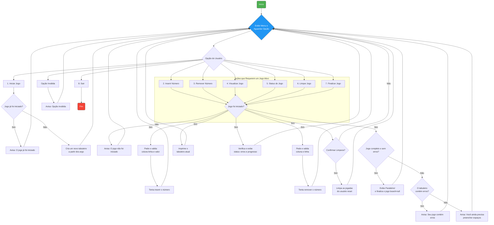

# Sudoku - Jogo de Console em Java

Este é um projeto simples de um jogo de Sudoku que roda no console, desenvolvido em Java. O objetivo é permitir que o usuário jogue uma partida de Sudoku através de uma interface de linha de comando interativa.

## 📜 Descrição

O jogo apresenta um tabuleiro de Sudoku 9x9 e oferece um menu de opções para que o jogador possa interagir. É possível iniciar um novo jogo (a partir de um template pré-definido passado por argumento), adicionar e remover números, visualizar o tabuleiro, verificar o status da partida e, finalmente, conferir se o jogo foi concluído com sucesso.

A lógica do jogo valida as regras do Sudoku, informando o jogador sobre o progresso e a existência de erros no preenchimento.

## ✨ Funcionalidades

O menu principal oferece as seguintes opções:

  * **1 - Iniciar um novo Jogo:** Prepara um novo tabuleiro de Sudoku, pronto para ser resolvido.
  * **2 - Colocar um novo número:** Permite ao jogador inserir um número (de 1 a 9) em uma célula específica (linha e coluna).
  * **3 - Remover um número:** Limpa o valor de uma célula específica que não seja um número fixo do template inicial.
  * **4 - Visualizar jogo atual:** Exibe o estado atual do tabuleiro de Sudoku no console.
  * **5 - Verificar status do jogo:** Informa se o jogo está completo, incompleto ou se contém erros (números repetidos em linhas, colunas ou quadrantes 3x3).
  * **6 - Limpar jogo:** Remove todos os números inseridos pelo jogador, restaurando o tabuleiro ao seu estado inicial.
  * **7 - Finalizar jogo:** Verifica se o tabuleiro está preenchido corretamente para finalizar a partida.
  * **8 - Sair:** Encerra a aplicação.

-----

## 🛠️ Como Executar o Projeto

Você pode executar o projeto de duas maneiras: via linha de comando ou utilizando o Visual Studio Code com a configuração recomendada.

### Método 1: Via Visual Studio Code (Recomendado)

Este método é mais simples e permite que o tabuleiro inicial seja carregado automaticamente.

1.  **Pré-requisitos:**

      * [JDK (Java Development Kit)](https://www.oracle.com/java/technologies/downloads/) instalado.
      * [Visual Studio Code](https://code.visualstudio.com/) instalado.
      * A extensão **Extension Pack for Java** da Microsoft instalada no VS Code.

2.  **Configuração:**

      * Abra a pasta raiz do projeto no VS Code.
      * Crie uma nova pasta chamada `.vscode` na raiz do projeto.
      * Dentro da pasta `.vscode`, crie um arquivo chamado `launch.json`.
      * Copie e cole o seguinte conteúdo no arquivo `launch.json`:

    <!-- end list -->

    ```json
    {
        "version": "0.2.0",
        "configurations": [
            {
                "type": "java",
                "name": "Executar Jogo Sudoku",
                "request": "launch",
                "mainClass": "br.com.sudoku.main",
                "projectName": "Sudoku", // Altere para o nome do seu projeto, se necessário
                "args": "0,0;4,false 1,0;7,false 2,0;9,true 3,0;5,false 4,0;8,true 5,0;6,true 6,0;2,true 7,0;3,false 8,0;1,false 0,1;1,false 1,1;3,true 2,1;5,false 3,1;4,false 4,1;7,true 5,1;2,false 6,1;8,false 7,1;9,true 8,1;6,true 0,2;2,false 1,2;6,true 2,2;8,false 3,2;9,false 4,2;1,true 5,2;3,false 6,2;7,false 7,2;4,false 8,2;5,true 0,3;5,true 1,3;1,false 2,3;3,true 3,3;7,false 4,3;6,false 5,3;4,false 6,3;9,false 7,3;8,true 8,3;2,false 0,4;8,false 1,4;9,true 2,4;7,false 3,4;1,true 4,4;2,true 5,4;5,true 6,4;3,false 7,4;6,true 8,4;4,false 0,5;6,false 1,5;4,true 2,5;2,false 3,5;3,false 4,5;9,false 5,5;8,false 6,5;1,true 7,5;5,false 8,5;7,true 0,6;7,true 1,6;5,false 2,6;4,false 3,6;2,false 4,6;3,true 5,6;9,false 6,6;6,false 7,6;1,true 8,6;8,false 0,7;9,true 1,7;8,true 2,7;1,false 3,7;6,false 4,7;4,true 5,7;7,false 6,7;5,false 7,7;2,true 8,7;3,false 0,8;3,false 1,8;2,false 2,8;6,true 3,8;8,true 4,8;5,true 5,8;1,false 6,8;4,true 7,8;7,false 8,8;9,false"
            }
        ]
    }
    ```

    > **Nota:** O campo `"args"` define o estado inicial do tabuleiro do Sudoku. Cada entrada no formato `"linha,coluna;valor,fixo"` configura uma célula.

3.  **Executando:**

      * Abra o arquivo `main.java`.
      * Vá para a aba "Executar e Depurar" (Run and Debug) na barra lateral esquerda do VS Code.
      * Selecione a configuração **"Executar Jogo Sudoku"** no menu suspenso e clique no ícone de play (▶️) para iniciar.

### Método 2: Via Linha de Comando (Tradicional)

Este método não carregará um tabuleiro inicial, pois os argumentos não serão passados da mesma forma. O código precisaria ser adaptado para ler o template de outra fonte (como um arquivo `BoardTemplate.java` fixo).

1.  **Compile os arquivos Java:** Navegue até o diretório `src` (se houver) e execute:

    ```bash
    javac br/com/sudoku/main.java br/com/sudoku/model/Board.java br/com/sudoku/model/Space.java
    ```

2.  **Execute a classe principal:** A partir do diretório que contém a pasta `br`, execute:

    ```bash
    java br.com.sudoku.main
    ```

-----

## 🕹️ Exemplo de Uso

Ao iniciar o programa (usando o método do VS Code), o menu interativo será exibido no console:

```
Selecione uma das opções a seguir
1 - Iniciar um novo Jogo
...
```

1.  Digite `1` para iniciar a partida. O tabuleiro será carregado com os dados definidos no `launch.json`.
2.  Digite `4` para visualizar o tabuleiro inicial.
3.  Digite `2` para adicionar um número. O programa pedirá a coluna, a linha e o valor.
4.  Continue jogando até preencher todo o tabuleiro e use as outras opções do menu conforme necessário.

-----

## 📊 Diagrama de Fluxo Lógico

O diagrama abaixo (renderizado em plataformas como o GitHub) ilustra o fluxo de controle da aplicação, mostrando como o programa reage às escolhas do usuário no menu principal.



### Explicação da Lógica do Diagrama

1.  **Início e Loop Principal:** O programa começa e entra imediatamente em um loop. O coração do programa é o nó **"Exibir Menu e Aguardar Opção"**. Ele representa o `while(true)` que sempre mostra as opções ao usuário.

2.  **Decisão Central:** Após o usuário digitar uma opção, o fluxo vai para a decisão **"Opção do Usuário"**, que funciona como o `switch` no seu código, direcionando para a lógica correta.

3.  **Iniciar Jogo (Opção 1):** Esta é a única ação que funciona sem um jogo pré-existente. Ela verifica se um jogo já está em andamento.

      * Se sim, apenas notifica o usuário.
      * Se não, cria uma nova instância do `Board` e prepara o jogo para começar.

4.  **Ações que Requerem um Jogo Ativo (Opções 2 a 7):**

      * Todas essas opções compartilham uma verificação inicial crucial: **"Jogo foi iniciado?"** (`if (isNull(board))`).
      * Se o jogo não foi iniciado, uma mensagem de aviso é exibida e o programa volta ao menu principal.
      * Se o jogo foi iniciado, a lógica específica de cada opção é executada.

5.  **Lógicas Específicas:**

      * **Inserir/Remover Número:** Pede as coordenadas (e o valor, no caso da inserção) e chama o método correspondente no objeto `Board`.
      * **Visualizar/Status:** Acessa os dados do `Board` para exibir o estado atual ou a validação do jogo.
      * **Limpar Jogo:** Adiciona um passo de confirmação para evitar a perda acidental de progresso.
      * **Finalizar Jogo:** Contém a lógica de verificação mais complexa. Primeiro, checa se o jogo está 100% correto. Se não, ele faz uma segunda verificação para distinguir entre um jogo com erros e um jogo simplesmente incompleto, fornecendo feedback mais preciso ao jogador.

6.  **Saída:** A opção **"Sair"** é o único caminho que quebra o loop principal e leva ao nó **"Fim"**, encerrando a aplicação (`System.exit(0)`).

7.  **Fluxo de Retorno:** Após a conclusão de qualquer ação (exceto "Sair"), o fluxo sempre retorna ao nó **"Exibir Menu"**, permitindo que o usuário realize uma nova ação.
